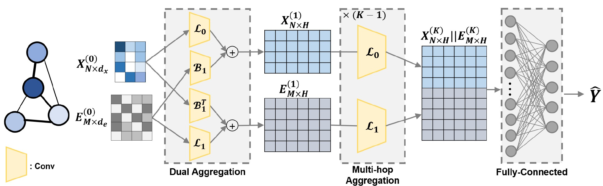

# [MICCAI'24] Multi-order Simplex-based Graph Neural Network for Brain Network Analysis

[Paper](https://link.springer.com/chapter/10.1007/978-3-031-72086-4_50)
- This is the official PyTorch implementation of Multi-order Simplex-based Graph Neural Network for Brain Network Analysis.
  


## Abstract

A brain network is defined by wiring anatomical regions in the brain with structural and functional relationships. It has an intricate topology with handful early features/biomarkers of neurodegenerative diseases, which emphasize the importance of analyzing connectomic features alongside region-wise assessments. Various graph neural network (GNN) approaches have been developed for brain network analysis, however, they mainly focused on node-centric analyses often treating edge features as an auxiliary information (i.e., adjacency matrix) to enhance node representations. In response, we propose a method that explicitly learns node and edge embeddings for brain network analysis. Introducing a dual aggregation framework, our model incorporates a novel spatial graph convolution layer with an incidence matrix. Enabling concurrent node-wise and edge-wise information aggregation for both nodes and edges, this framework captures the intricate node-edge relationships within the brain. Demonstrating superior performance on the Alzheimer’s Disease Neuroimaging Initiative (ADNI) dataset, our model effectively handles the complex topology of brain networks. Furthermore, our model yields interpretable results with Grad-CAM, selectively identifying brain Regions of Interest (ROIs) and connectivities associated with AD, aligning with prior AD literature.

## Citation

If you find our work useful for your research, please cite our paper:
```bibtex
@inproceedings{hwang2024multi,
  title={Multi-order simplex-based graph neural network for brain network analysis},
  author={Hwang, Yechan and Hwang, Soojin and Wu, Guorong and Kim, Won Hwa},
  booktitle={International Conference on Medical Image Computing and Computer-Assisted Intervention},
  pages={532--541},
  year={2024},
  organization={Springer}
}
